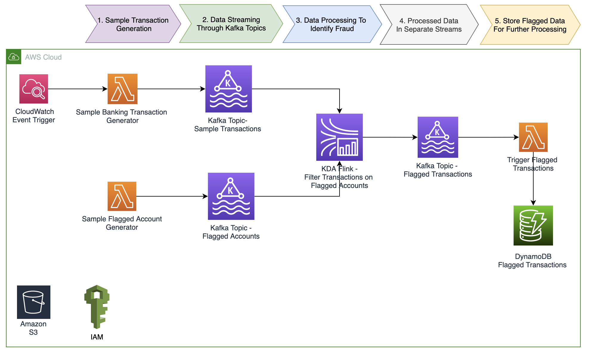

# CONFIGURE AWS SERVICES

Now that you have completed setting up the workshop enviornment, there are just a few more steps so the services communicate with each other. These steps will configure Kinesis to use managed streaming for Kafka and allow viewing the Kafka topics through a viewer interface.

These are the services that will be used:

1. Amazon Managed Streaming for Apache Kafka (Amazon MSK)
2. Amazon DynamoDB
3. Amazon Kinesis
4. AWS CloudFormation

The environment for this lab consists of:

An EC2 instance with kafdrop.
Kafdrop is a web UI for viewing Kafka topics and browsing consumer groups. The tool displays information such as brokers, topics, partitions, consumers, and lets you view messages.
In addition to the EC2 instance and networking components, the provided CloudFormation script creates the following AWS resources

A Managed Streaming for Kafka (MSK) cluster

A Kinesis Data Anayltics application

A DynamoDB fraud audit table

## Kafka Topics
1. Demo_transactions: Topic to hold sample transactions (populated by Lambda SampleTransactionGenerator)
This topic should have transaction as sample transaction lambda function was started by the cloud formation script

2. Flagged_accounts: Topic to hold flagged account Ids (populated by Lambda FlagAccountGenerator)
Initially, this topic will be empty as we need to manually run the lambda function to generate flagged acounts

3. Processed_topic: Topic to hold flagged transactions (populated by flink application)
Initially, this topic will also be empty but will become populated once the sample transaction can successfully join with Flagged Accounts

